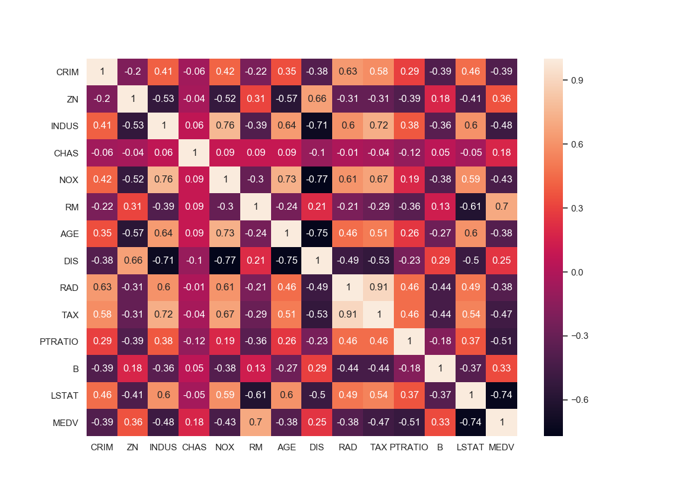
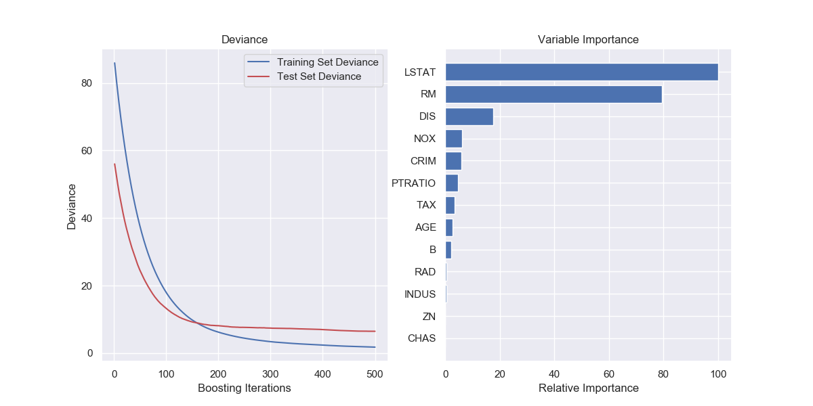
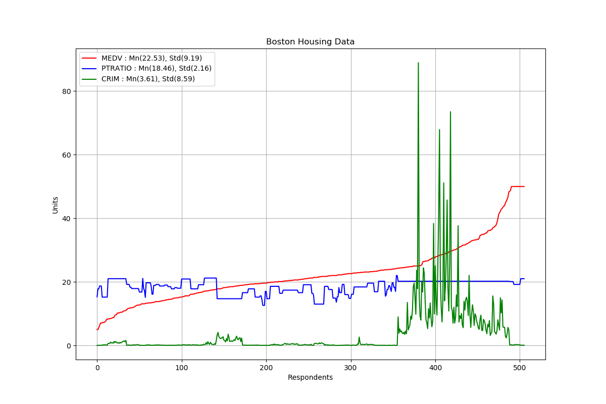

# cebd1160: Boston Housing Neighborhood Identification

| Name | Date |
|:-------|:---------------|
|Luigi Clerici | March 23, 2019|

-----

### Resources
Your repository should include the following:

- Python script for your analysis: boston_regr_final.py
- Results figure/saved file : Project/
- Dockerfile for your experiment: Dockerfile
- Runtime-instructions : RUNME.md

-----

## Research Question

Can you pinpoint the areas in the Boston region that would be ideal to bring up a family?  The analysis is based upon the use of 3 attributes selected as major factors in this investigation.  Affordability, schooling and peace of mind translating to attributes MEDV, PTRATIO and CRIM.

### Abstract

Through the use of the Boston housing dataset we tried to conclude, based on the relationship of 3 of the attributes, that we can successfully target ideal regions for raising a family.  Tests were conducted to validate the importance of the attributes, their one to one relationship and a comparison of the subset vs the full dataset in hopes that the test results would provide the necessary insight into making an informed decision.  Based on the conducted tests, the results are not strong enough to confirm with certainty that we would establish the ideal regions with precision.   

### Introduction

The dataset used for this analysis was the load_boston taken from [scikit-learn.org](https://scikit-learn.org/stable/datasets/index.html#boston-dataset).  There are 3 chart types included.  A plot isolating the 3 attributes, a HEATMAP including all attributes along with a Gradient Boosting Regression chart displaying all attributes.  The included script also generates an RMSE and R2 score for the data subset and full dataset.

### Methods

To interpret the data, we chose a combination of charting and interpretation of the calculations of the RMSE and R2 scores.  This was done for the subset as well as for the full dataset.  

We used a correlation matrix to facilitate the understanding of the data and the possible relationships between any 2 attributes amongst them the targeted attributes.  A Gradient Boosting Regression model was also used which allows us to rank the attributes by their relative importance within the dataset and a plot graph with a sorted MEDV target to allow for easier visualization in identifying any trends within the subset.

### Results

Brief (2 paragraph) description about your results. Include:

- At least 1 figure
- At least 1 "value" that summarizes either your data or the "performance" of your method
- A short explanation of both of the above

We performed training and testing on the dataset and subset:

#### Model performance testing and training performed on ALL ATTRIBUTES vs TARGET MEDV

*The model performance for training set*

Returned an RMSE of 4.741000992236516 along with an R2 score of 0.738339392059052

*The model performance for testing set*

Returned an RMSE of 4.568292042303218 along with an R2 score of 0.7334492147453064

#### Model performance testing and training performed on CRIM and PTRATIO vs MEDV

*The model performance for training set*

Returned an RMSE of 7.6144001885660035 along with an R2 score of 0.3250530330112821

*The model performance for testing set*

Returned an RMSE of 7.389189284263164 along with an R2 score of 0.30262587374686933

*GradientBoostingRegressor Model MSE (Full Dataset)*

Mean Squared Error: 6.3330

### Discussion
Brief (no more than 1-2 paragraph) description about what you did. Include:

- interpretation of whether your method "solved" the problem
- suggested next step that could make it better.

### References
All of the links
https://towardsdatascience.com/linear-regression-on-boston-housing-dataset-f409b7e4a155
https://scikit-learn.org/stable/auto_examples/ensemble/plot_gradient_boosting_regression.html

-------
