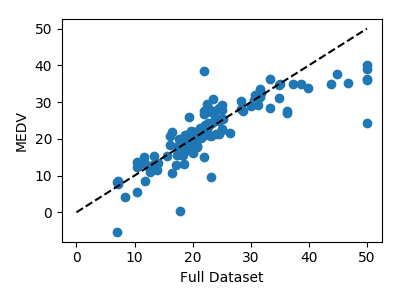
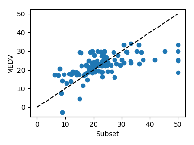

# cebd1160: Boston Housing Subset Evaluation

| Name | Date |
|:-------|:---------------|
|Luigi Clerici | March 23, 2019|

-----

### Resources
Your repository should include the following:

- Python script for your analysis: 'boston_regr_final.py'
- Results figure/saved file : 'Project/'
- Dockerfile for your experiment: 'Dockerfile'
- Runtime-instructions : 'RUNME.md'

-----

## Research Question

Can we pinpoint the areas in the Boston region that would be ideal to raise a family?  The analysis is based upon the use of 3 attributes that were selected as major factors.  They are home median value (MEDV), pupil-teacher ratio (PTRATIO) and crime rate (CRIM).

### Abstract

Through the use of the Boston housing dataset we tried to conclude, based upon the relationship of 3 of the attributes, that we could successfully target ideal regions for raising a family.  Tests were conducted to validate the importance of the attributes, their one to one relationship and a comparison of the subset vs the full dataset.  This was done in hopes that the results would provide the necessary insight into making an informed decision on best family locations.  Based on the conducted tests, the results were not strong enough to confirm with certainty that we would establish the ideal regions with precision.   

### Introduction

The dataset used for this analysis was the load_boston taken from [scikit-learn.org](https://scikit-learn.org/stable/datasets/index.html#boston-dataset).  The following charts were included.  A plot isolating the 3 attributes, a HEATMAP including all attributes, a Relative Importance chart displaying all attributes and 2 regression charts comparing all datasets vs the targeted attributes.  The included script also generates an RMSE and R2 score for the data subset and full dataset.

### Methods

To interpret the data, we chose a combination of charting and calculations of the RMSE and R2 scores for the subset as well as the full dataset.  

For charting purposes, we used a correlation matrix to facilitate the understanding of the data and the possible relationships between any 2 attributes amongst them the targeted attributes.  A Gradient Boosting Regression model was also used which allows us to rank the attributes by their relative importance within the dataset and a plot graph with a sorted MEDV target to allow for easier visualization in identifying any trends within the subset.

### Results

 

The regression charts above show that the full dataset fits best compared to the subset.  If we look under methods, the Heatmap correlations demonstrate a midrange negative correlation between PTRATIO and MEDV (-0.51) along with a weak negative correlation between CRIM and MEDV (-0.39).  The Gradient Boosting Regression model used on the dataset ranks the PTRATIO and CRIM attributes in the middle of the list for relative importance.  

Model training and testing was performed on the dataset and subset to compare the values and gauge their importance vis a vis the dataset.  The subset scored higher in RMSE and lower in R2 which in both cases is a sign that the subset values are weaker compared to the usage of the full dataset.

#### Model performance testing and training performed on ALL ATTRIBUTES vs TARGET MEDV

*The model performance for training set*

Returned an RMSE of 4.741000992236516 along with an R2 score of 0.738339392059052

*The model performance for testing set*

Returned an RMSE of 4.568292042303218 along with an R2 score of 0.7334492147453064

#### Model performance testing and training performed on CRIM and PTRATIO vs MEDV

*The model performance for training set*

Returned an RMSE of 7.6144001885660035 along with an R2 score of 0.3250530330112821

*The model performance for testing set*

Returned an RMSE of 7.389189284263164 along with an R2 score of 0.30262587374686933

### Discussion

Can these attributes be used to correctly pinpoint the goal of this analysis?  Based on the results, the targeted attributes are not a great indicator in their current state.  Further analysis can potentially reveal more insight.  A larger dataset might aid in the analysis and modify our data scores for our subset.  Possibly incorporating other attributes (see list below) and testing on different combinations along with the number of attributes, in conjunction with the original 2 tested against the MEDV, might provide a clearer answer.

- TAX full-value property-tax rate per $10,000
- LSTAT % lower status of the population
- RM average number of rooms per dwelling
- DIS weighted distances to five Boston employment centres
- RAD index of accessibility to radial highways

### References

https://towardsdatascience.com/linear-regression-on-boston-housing-dataset-f409b7e4a155

https://scikit-learn.org/stable/auto_examples/ensemble/plot_gradient_boosting_regression.html

https://scikit-learn.org/stable/modules/generated/sklearn.ensemble.GradientBoostingRegressor.html

https://blog.goodaudience.com/linear-regression-on-the-boston-housing-data-set-d18c4ce4d0be

https://www.bmc.com/blogs/mean-squared-error-r2-and-variance-in-regression-analysis/

https://scipy-lectures.org/packages/scikit-learn/auto_examples/plot_boston_prediction.html

https://scipy-lectures.org/packages/scikit-learn/index.html

-------
